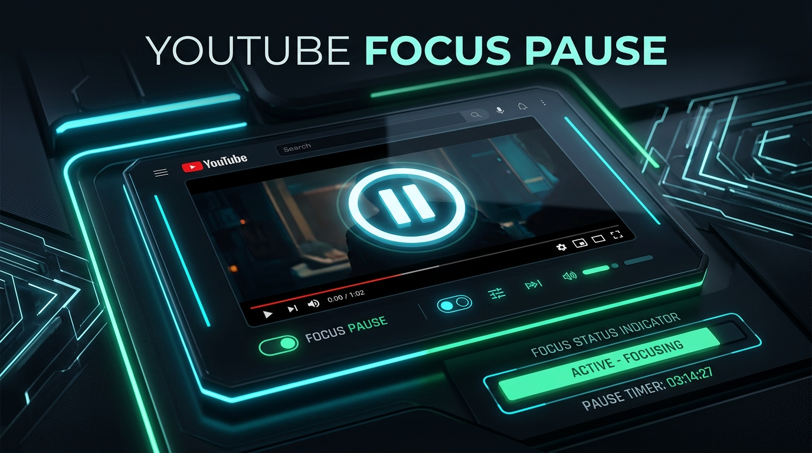
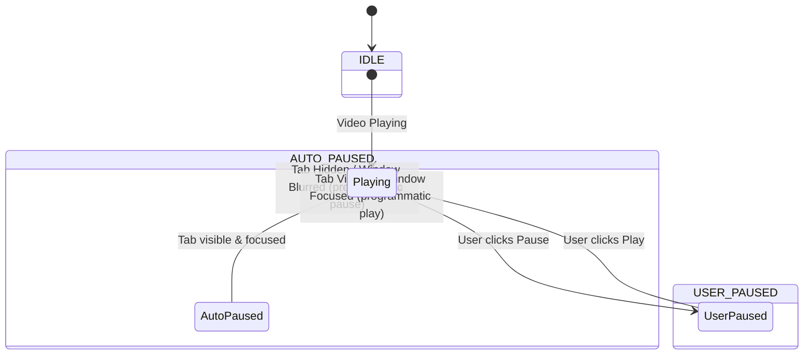
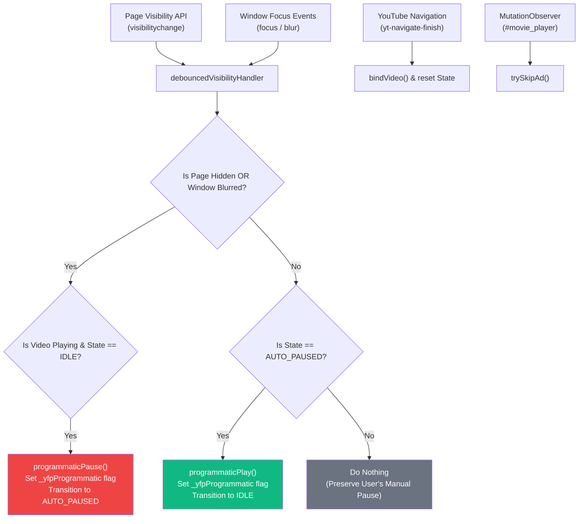

<div align="center">

  

  # ⏸️ YouTube Focus Pause

  **Automated, event-driven Chrome Extension (Manifest V3) that intelligently pauses YouTube videos when you switch tabs or leave Chrome — and seamlessly resumes them when you return.**

  [](https://developer.chrome.com/docs/extensions/mv3/intro/)
  [](https://developer.mozilla.org/en-US/docs/Web/JavaScript)
  [](LICENSE)
  [](https://developer.mozilla.org/en-US/docs/Web/API/Page_Visibility_API)

</div>

---

## 🌟 Key Features

- **⚡ Instant Pause on Tab Switch**: Automatically pauses YouTube playback as soon as you switch to another Chrome tab.
- **🔄 Auto-Resume on Tab Return**: Playback resumes from the exact timestamp when you return to the YouTube tab.
- **🖥️ Chrome OS Focus Detection**: Pauses video when you switch away to another application (VS Code, Discord, Spotify, etc.) via `Alt-Tab`.
- **🪟 Minimize & Restore Handling**: Minimizing Chrome pauses the video; restoring the window auto-resumes playback.
- **🧠 Smart Manual Pause Respect**: Never auto-resumes if *you* manually paused the video yourself.
- **⏩ Auto-Skip Skippable Ads**: Automatically clicks YouTube's native "Skip Ad" button as soon as it becomes available.
- **🚀 Single-Page App (SPA) Support**: Full support for internal YouTube navigation, playlists, and video switching without page reloads.

---

## 📊 Visual State Machine Architecture

The extension uses an event-driven state machine per `<video>` element with zero polling overhead.



---

## 🏗️ Architecture & Component Flow



---

## 📂 Directory Structure

```
youtube-extention/
├── assets/
│   └── banner.png       # High-resolution project header banner
├── icons/
│   ├── icon16.png       # 16x16 Extension toolbar icon
│   ├── icon48.png       # 48x48 Extension management icon
│   └── icon128.png      # 128x128 Web Store display icon
├── manifest.json        # Manifest V3 extension definition
├── background.js        # Minimal service worker (default storage init)
├── content.js           # Core engine: event listeners, state machine, ad skipper
├── popup.html           # Dark-themed extension control popup
├── popup.js             # Live storage sync & toggle controller
├── popup.css            # Glassmorphic UI styles
└── README.md            # Repository documentation
```

---

## 🛠️ Installation Guide (Unpacked Extension)

1. **Clone or Download** this repository:
   ```bash
   git clone https://github.com/yugsuthar208/youtube-extention.git
   ```
2. Open **Google Chrome** and navigate to `chrome://extensions/`.
3. Enable **Developer mode** in the top right corner.
4. Click **Load unpacked** and select the `youtube-extention` directory.
5. Open any video on [YouTube](https://www.youtube.com) and experience automatic focus pausing!

---

## 🔐 Permissions Explanation

| Permission | Purpose |
|---|---|
| `storage` | Persists user enable/disable toggle setting across sessions via `chrome.storage.sync`. |
| `host_permissions` (`*://*.youtube.com/*`) | Allows content script injection strictly on YouTube domains. No access to other websites. |

*No `tabs` or invasive permissions requested — operates entirely within content script scope.*

---

## 📄 License

Distributed under the MIT License. See `LICENSE` for more information.
